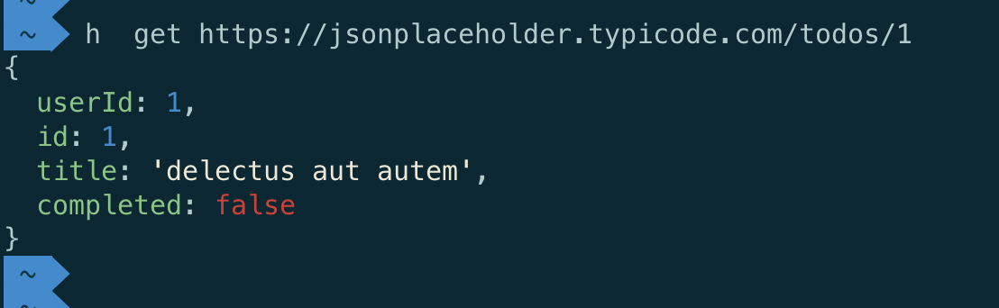
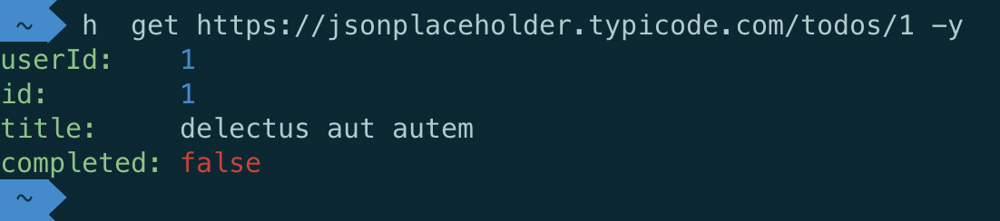
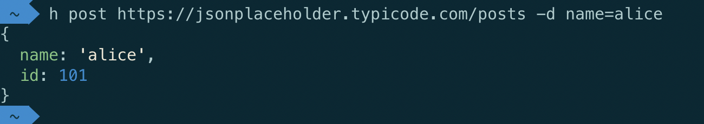
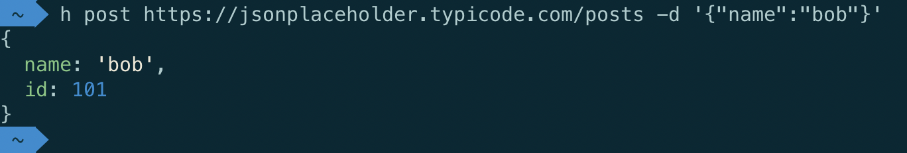

# H

> Simple CLI to query HTTP endpoints.

## Install

```bash
npm i -g http-request-cli
```

> Now you have `h` as a command to query http endpoint in your terminal.

## Usage

```bash
Usage: h [options] [command]

Options:
  -V, --version               output the version number
  -v, --verbose               Verbose mode
  --no-color                  Monochrome display
  -o, --output <file name>    Save response to a file
  -y, --yaml                  Render JSON data in a coloured YAML-style
  -H, --header <name=value>   Set a header (default: {})
  -d, --data [data]           Content of request
  -D, --datafile <file name>  
  -t, --type <content type>   Content type
  -c, --cookie <cookie file>  Cookie file
  -h, --help                  output usage information

Commands:
  get <url> [options]         Send a GET request
  post <url> [options]        Send a POST request
  put <url> [options]         Send a PUT request
  delete <url> [options]      Send a DELETE request
  patch <url> [options]       Send a PATCH request
  head <url> [options]        Send a HEAD request
```

## Examples

* Simple GET request

```bash
h get https://jsonplaceholder.typicode.com/todos/1
```



* GET request with response formatted as YAML

```bash
h get https://jsonplaceholder.typicode.com/todos/1 -y
```



* POST request with data provided as properties and converted into JSON

```bash
h post https://jsonplaceholder.typicode.com/posts -d name=alice
```



* POST request with data provided as properties and converted into JSON

```bash
h post https://jsonplaceholder.typicode.com/posts -d '{"name":"bob"}'
```


